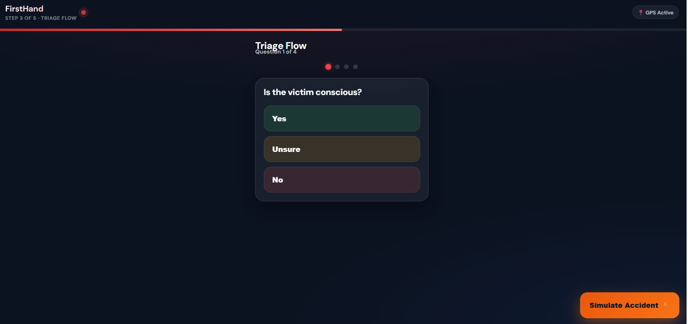
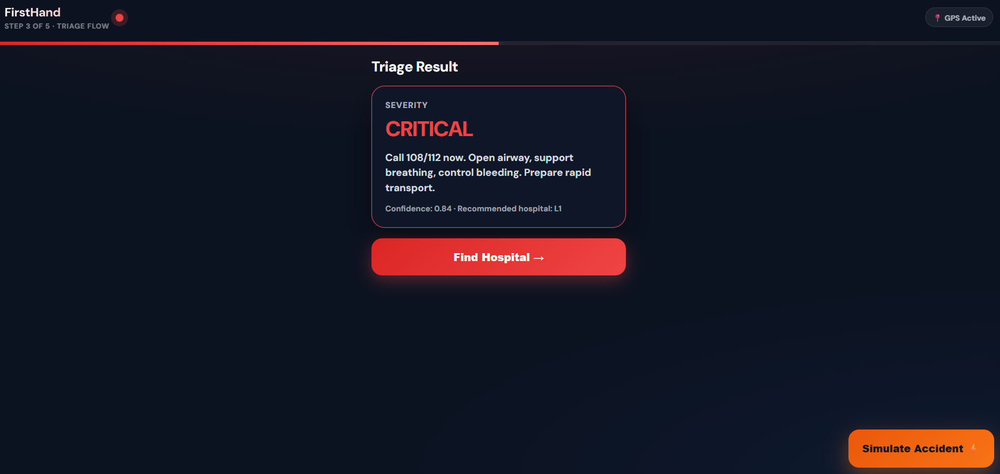
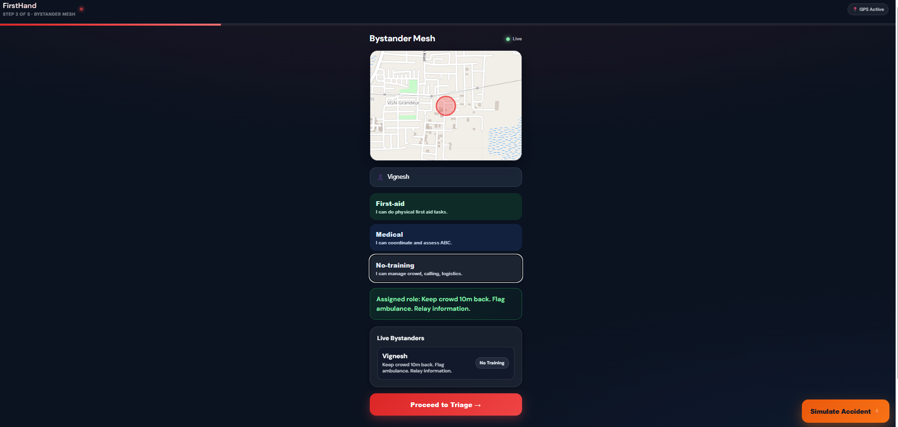
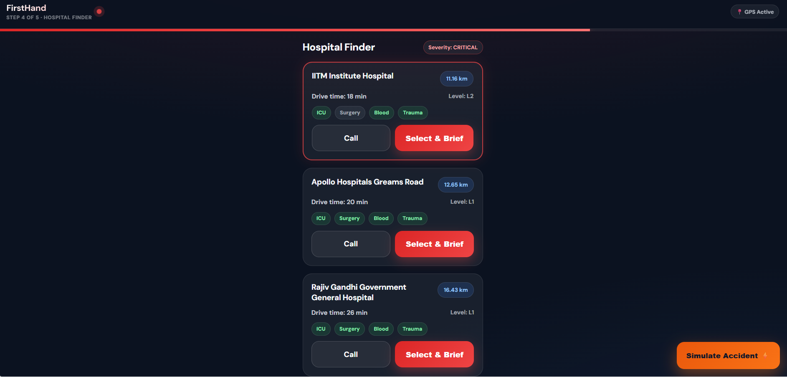
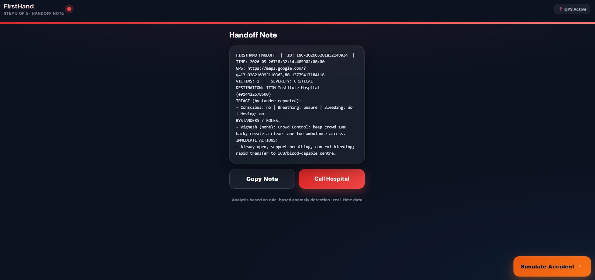
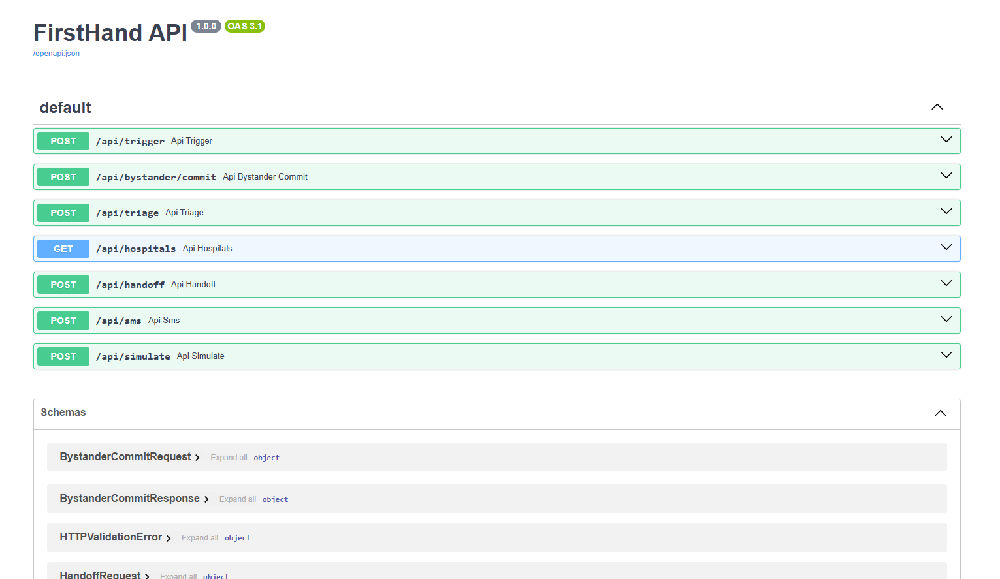
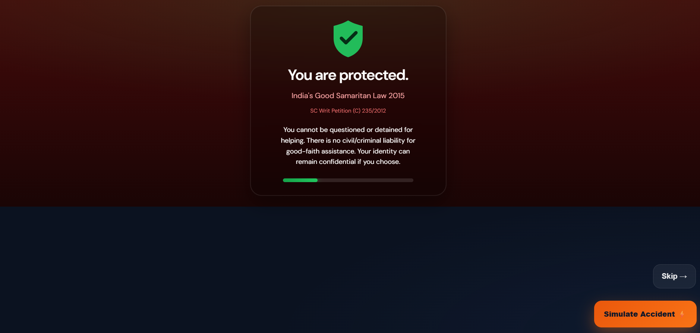

# FirstHand 🚑
### AI-Assisted Emergency Response Platform


## 🚨 Problem Statement

In critical emergencies, delays in:

- bystander coordination
- triage assessment
- hospital discovery
- emergency communication

can cost lives.

Victims often suffer during the "golden hour" because emergency response systems are fragmented and uncoordinated.

FirstHand helps coordinate emergency response instantly using real-time workflows and AI-assisted decision support.


## 💡 Solution

FirstHand is an AI-assisted emergency response coordination platform built for rapid accident response, triage, hospital routing, and emergency handoff in real time.

The platform enables:
- Real-time bystander coordination
- Guided emergency triage
- Intelligent hospital discovery
- Structured emergency handoff generation
- Emergency workflow simulation


## Features

### Accident Simulation
- Simulated emergency trigger system
- Real-time workflow activation

### 👥 Real-time Bystander Coordination
- Crowd coordination system
- Role assignment:
  - First Aid
  - Medical Lead
  - Crowd Control

### AI-Assisted Triage Flow
- Guided emergency assessment
- Severity classification:
  - Critical
  - Serious
  - Stable

### 🏥 Smart Hospital Routing
- Nearby hospital recommendation
- Distance-based routing
- Drive-time estimation
- Capability filtering:
  - ICU
  - Trauma Care
  - Surgery
  - Blood Availability

### 📄 Emergency Handoff Notes
- Structured emergency briefing
- Victim condition summary
- GPS location support
- Bystander role tracking

### 📡 Live Backend APIs
- FastAPI-powered backend
- Swagger/OpenAPI documentation
- WebSocket-based live updates

### Modern Responsive UI
- Dark-themed emergency dashboard
- Responsive mobile-friendly design
- Real-time workflow visualization


##  Demo Flow

1. Simulate emergency incident
2. Nearby bystanders join coordination mesh
3. AI-assisted triage evaluates victim
4. Severity level is generated
5. Nearby hospitals are recommended
6. Emergency handoff note is generated
7. Hospital receives structured briefing


## 📸 Demo Screenshots

### 🚨 Triage Flow


### ⚠️ Severity Result


### 👥 Bystander Coordination


### 🏥 Hospital Finder


### 📄 Emergency Handoff


### 📡 Swagger API Documentation


### 🛡️ Good Samaritan Protection



## System Architecture

```text
User / Bystander
        ↓
React Frontend (Vite)
        ↓
FastAPI Backend
        ↓
Triage Engine
        ↓
Hospital Recommendation System
        ↓
Emergency Handoff Generator
        ↓
Hospital Communication Flow
````


## Tech Stack

### Frontend

* React
* Vite
* CSS3
* Leaflet Maps

### Backend

* FastAPI
* Python
* SQLite
* WebSockets

### APIs & Services

* Swagger/OpenAPI
* REST APIs
* Live WebSocket Updates


## 🏥 Hospital Routing

The platform dynamically routes incidents to nearby hospitals based on:

* distance
* severity
* trauma capability
* ICU availability
* surgery support

Includes IITM Institute Hospital integration for Chennai-based routing simulation.


## 📡 API Endpoints

| Method | Endpoint                | Description           |
| ------ | ----------------------- | --------------------- |
| POST   | `/api/trigger`          | Trigger emergency     |
| POST   | `/api/bystander/commit` | Commit bystander role |
| POST   | `/api/triage`           | Emergency triage      |
| GET    | `/api/hospitals`        | Hospital discovery    |
| POST   | `/api/handoff`          | Generate handoff note |
| POST   | `/api/sms`              | Emergency SMS         |
| POST   | `/api/simulate`         | Run simulation        |


## Local Setup

### Backend

```bash
cd backend
pip install -r requirements.txt
py -3 -m uvicorn main:app --reload --port 8000
```

### Frontend

```bash
cd frontend
npm install
npm run dev
```


## 🌐 Local URLs

| Service      | URL                                                      |
| ------------ | -------------------------------------------------------- |
| Frontend     | [http://127.0.0.1:5173](http://127.0.0.1:5173)           |
| Backend API  | [http://127.0.0.1:8000](http://127.0.0.1:8000)           |
| Swagger Docs | [http://127.0.0.1:8000/docs](http://127.0.0.1:8000/docs) |


## 📂 Project Structure

```text
FirstHand-EmergencyResponse/
│
├── backend/
│   ├── main.py
│   ├── db.py
│   ├── hospitals.py
│   ├── sms.py
│   ├── triage.py
│   └── requirements.txt
│
├── frontend/
│   ├── src/
│   ├── public/
│   └── package.json
│
├── screenshots/
│
├── .gitignore
├── LICENSE
└── README.md
```


## Impact

FirstHand is designed to reduce emergency response delays during the critical golden hour after accidents.

By improving coordination between bystanders, hospitals, and emergency responders, the platform aims to save lives through faster and smarter emergency workflows.


## 🚀 Future Scope

* Real ambulance integration
* Live GPS tracking
* AI voice-assisted triage
* Government emergency integration
* Real-time hospital bed availability
* Multi-language emergency support
* Offline disaster response mode
* Mobile app deployment


## Key Highlights

* Modern dark-themed responsive UI
* Real-time emergency coordination
* Hospital capability filtering
* WebSocket-based live updates
* IIT Madras hospital integration
* Modular FastAPI backend
* Clean React frontend architecture
* Simulation-driven emergency workflow


## 👨‍💻 Team

### Tech-Super-Kings

## 📜 License

MIT License

```
```
